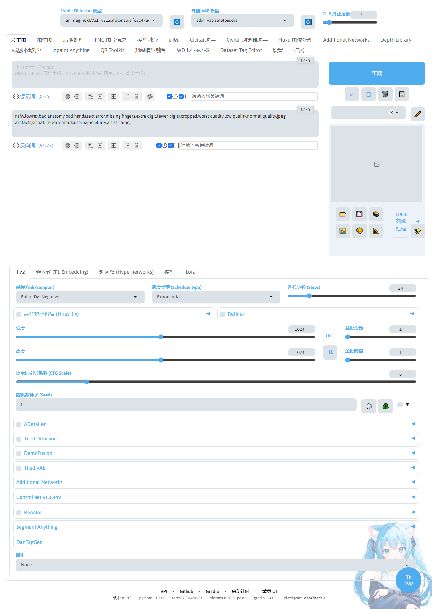
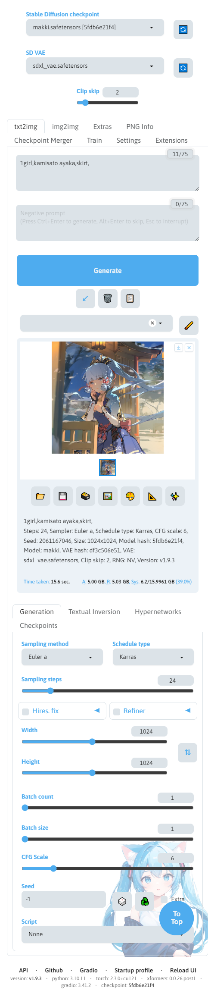

# SD Webui Mobile Friendly 
<h4 align="right"><i>BETA</i></h4>

This is an extension for the [Automatic1111 Webui](https://github.com/AUTOMATIC1111/stable-diffusion-webui), which modifies the UI layout to make it ~~slightly~~ easier to navigate when viewed in **portrait** mode.

## Features
1. Move the Generation Result under the **Generate** button
    - **i.e.,** Above the parameter settings
2. Add a new button at the bottom of the page that scrolls to the top when clicked
3. Make some buttons slightly larger
    - Specifically the `tool` class
4. Increase the padding between sliders
5. Center the buttons in a `form`

## Changes
1. Modified the style of the 'jump to top' button at the bottom, adding a scroll animation and fixing its position relative to the viewport.
2. Fixed the image generation box layout for the current Webui version
3. Made some adjustments to the compact prompt layout,only the 'to top' button is added in this mode.

## Installation
1. Navigate to the `extensions/` directory.
2. Run the following command to clone the repository:
    ```bash
    git clone https://github.com/MakkiShizu/sd-webui-mobile-friendly.git
    ```

### example


<hr>
